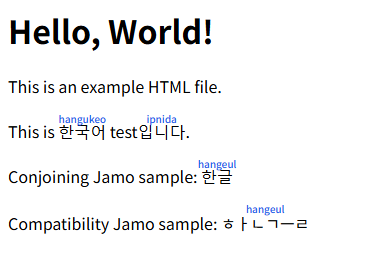

# Hangeul Ruby

Web ページ上のハングル文字列を検出し、ローマ字のルビを `ruby` / `rt` で追加する Chrome 拡張です。

韓国語の練習用に作った簡易ツールです。ローマ字表記は学習補助を目的とした近似であり、正確な発音表記や辞書的な読みを保証するものではありません。

## 機能

- ページ内の完成形ハングル音節 `가-힣` と一般的な字母表記を検出
- DOM のテキストノードだけを置換し、既存のイベントや構造への影響を抑制
- `script`, `style`, `input`, `textarea`, `code`, `pre`, 既存 `ruby` などは除外
- 遅延読み込みされた DOM にも `MutationObserver` で対応
- popup から ON/OFF と「常に表示 / ホバー時のみ」を切り替え
- この拡張機能は、ページ上のテキストを外部サーバーへ送信しません。ハングル検出とローマ字変換はブラウザ内で行います。

## 動作環境

- Chrome でのみ動作確認しています
- Firefox やその他のブラウザでの動作は未確認・未保証です
- 現時点では Chrome ウェブストアでの配布は想定していません

## インストール

Chrome の開発者向け機能で、パッケージ化されていない拡張機能として読み込んでください。

1. Chrome で `chrome://extensions/` を開く
2. 「デベロッパーモード」を有効にする
3. 「パッケージ化されていない拡張機能を読み込む」を選ぶ
4. このフォルダを選択する

インストール方法、ブラウザ設定、各環境での読み込み手順などについて、個別のサポートは行いません。

## ローマ字変換

Unicode のハングル音節を初声・中声・終声に分解し、簡易的な Revised Romanization 風の表記へ変換しています。発音変化、連音化、鼻音化、濃音化、辞書ベースの読み分けはまだ扱っていません。

例:

- `한글` -> `hangeul`
- `한글` -> `hangeul` （字母表記）
- `ㅎㅏㄴㄱㅡㄹ` -> `hangeul`
- `한국어` -> `hangukeo`
- `안녕하세요` -> `annyeonghaseyo`

## 免責

このソフトウェアは MIT License に基づき、現状有姿で提供されます。作者は、動作、正確性、特定目的への適合性、継続的な保守、利用によって生じる問題について一切保証しません。

この拡張機能の使用、改変、再配布、または使用不能によって生じたいかなる損害についても、作者は責任を負いません。詳細は [LICENSE](LICENSE) を確認してください。

## 今後の改善候補

- 発音変化ルールの追加
- サイト別の有効/無効設定
- 記事本文らしい領域だけを対象にするモード
- ルビサイズや色の設定
- 単語単位の辞書読み補正
